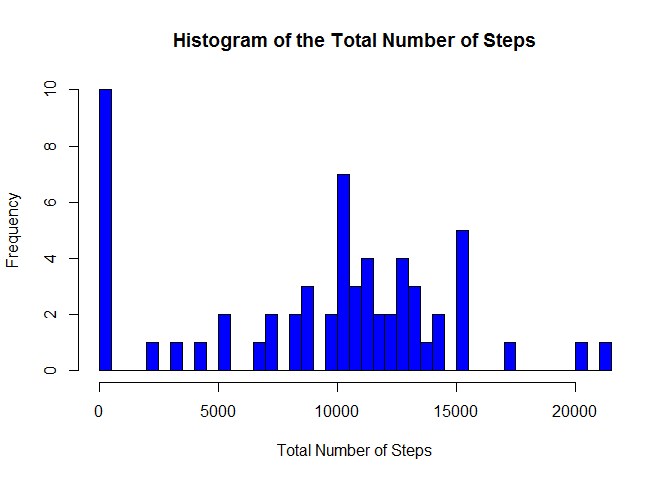
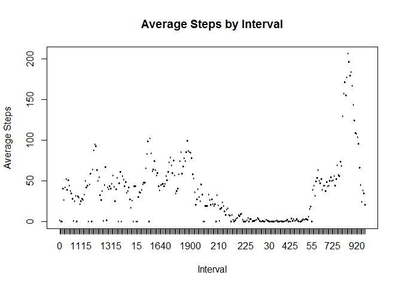
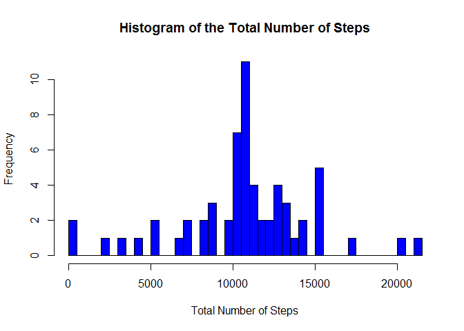
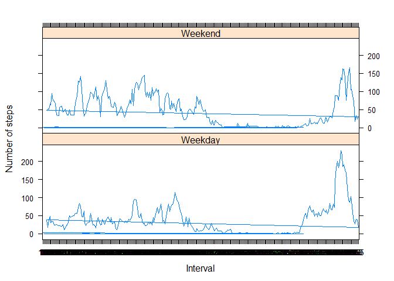

# Reproducible Research: Peer Assessment 1
Kevin DeCatur  

```r
echo = TRUE 
options(scipen = 1)
```

### Loading and preprocessing the data

1. Load the data (i.e. `read.csv()`)


```r
data <- read.csv("activity.csv", header = T, colClasses = c("integer", "Date", "factor"))
```

2. Process/transform the data


```r
library(data.table)
dataTable = data.table(data)
dataTableByDay = dataTable[, list(steps = sum(steps, na.rm = T)), 
                 by = date]
```

### What is mean total number of steps taken per day?

1. Make a histogram of the total number of steps taken each day


```r
hist(dataTableByDay$steps, 
     breaks = 50,
     main = "Histogram of the Total Number of Steps",
     xlab = 'Total Number of Steps', col = 'blue')
```

 

2. Calculate and report the **mean** and **median** total number of steps taken per day


```r
meanSteps = mean(dataTableByDay$steps)
medianSteps = median(dataTableByDay$steps)
```
  
  
The mean number of steps is 9354.2295082.  
The median number of steps is 10395.

### What is the average daily activity pattern?

1. Make a time series plot (i.e. `type = "l"`) of the 5-minute interval (x-axis) and the average number of steps taken, averaged across all days (y-axis)


```r
dataTableMeanByInterval =   dataTable[, list(avgSteps = mean(steps, na.rm = T)), 
                            by = interval]

plot(dataTableMeanByInterval$interval, dataTableMeanByInterval$avgSteps, type = 'l',
             main = 'Average Steps by Interval',
             xlab = 'Interval',
             ylab = 'Average Steps')
```

 

2. Which 5-minute interval, on average across all the days in the dataset, contains the maximum number of steps?


```r
maxInterval = dataTableMeanByInterval[which.max(avgSteps), interval]
maxSteps = dataTableMeanByInterval[which.max(avgSteps), avgSteps]
```
  
  
The max number of steps per interval accross all days is 206.1698113 at interval # 835.    
 
   
### Imputing missing values

1. Calculate and report the total number of missing values in the dataset (i.e. the total number of rows with `NA`s)


```r
sumNA = sum(is.na(dataTable$steps))
```

The total number of missing values is 2304.  
  
  
2. Devise a strategy for filling in all of the missing values in the dataset. The strategy does not need to be sophisticated. For example, you could use the mean/median for that day, or the mean for that 5-minute interval, etc.

For each value of 'steps'that has no value, the value will be set to the mean number of steps of all other observations with the same interval #.


3. Create a new dataset that is equal to the original dataset but with the missing data filled in.


```r
dataTable2 <- dataTable 
for (i in 1:nrow(dataTable2)) {
    if (is.na(dataTable2$steps[i])) {
        dataTable2$steps[i] <- round(dataTableMeanByInterval[which(dataTable2$interval[i] == dataTableMeanByInterval$interval), ]$avgSteps)
     
    }
}

dataTable2ByDay = dataTable2[, list(steps = sum(steps)), 
                          by = date]
```

4. Make a histogram of the total number of steps taken each day and Calculate and report the **mean** and **median** total number of steps taken per day. Do these values differ from the estimates from the first part of the assignment? What is the impact of imputing missing data on the estimates of the total daily number of steps?


```r
hist(dataTable2ByDay$steps, 
     breaks = 50,
     main = "Histogram of the Total Number of Steps",
     xlab = 'Total Number of Steps', col = 'blue')
```

 


```r
meanSteps2 = mean(dataTable2ByDay$steps)
medianSteps2 = median(dataTable2ByDay$steps)
```
  
After filling missing data, the mean number of steps changed from 9354.2295082 to  10765.6393443.      

The median number of steps changed from 10395 to 10762.  
  
  
      
### Are there differences in activity patterns between weekdays and weekends?

1. Create a new factor variable in the dataset with two levels -- "weekday" and "weekend" indicating whether a given date is a weekday or weekend day.


```r
fDayType = function(x){
        if(weekdays(x,abbreviate=T) %in% c('Sat', 'Sun')){
                return('Weekend')
        }
        return('Weekday')
}

dataTable2$dayType = as.factor(mapply(fDayType,dataTable2$date))
dataTable2DayType = dataTable2[, list(steps = mean(steps, na.rm = T)), 
                          by = list(interval, dayType)]
```


2. Make a panel plot containing a time series plot (i.e. `type = "l"`) of the 5-minute interval (x-axis) and the average number of steps taken, averaged across all weekday days or weekend days (y-axis). The plot should look something like the following, which was created using **simulated data**:


```r
library(lattice)
xyplot(dataTable2DayType$steps ~ dataTable2DayType$interval | dataTable2DayType$dayType, 
       layout = c(1, 2), type = "l", 
       xlab = "Interval", ylab = "Number of steps")
```

 

